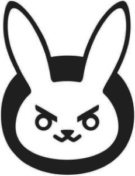

# Miniature Art Projects

This repository features multiple projects for generating or modifying images. These projects were done for my own amusement and are neither efficient or polished. This repository only serves to keep my old ideas organized in case I decide to transform one into a proper program.

The documentation is severely lacking, but every project contains a test file which helps understand how the machinery works. For any further information simply send me a message.

---
## ASCII Art

A deterministic ASCII art generator. The user sets:
- a picture, which is to be approximated;
- a letter pool, from which symbols for the generated picture are chosen;
- (*optional*) a colour pool, from which the colour of symbols is chosen;
- (*optional*) a background colour.

To modify the font (either type or size) one must modify the `artist.py` file, as it is currently hard-coded.

The algorithm chooses an optimal symbol for each section of the picture, with the metric being (linear) pixel difference. The runtime is linear in size of picture, size of letter pool, and size of colour pool.

---
## Gradual coloring

A simple project that approximates images by drawing shapes over an empty canvas. The code is very suboptimal (manual image modification in python) and the results are not that very exciting. The successor project is **shape-genetics**. It is kept on the repository since it has both a `python` and `ocaml` implementation.

The user sets:
- a picture, which is gradually approximated by painting shapes;
- the number of steps;
- (*optional*) shapes being used, either rectangles, circles, or brush-strokes. The choice is hard-coded.

At every step, the algorithm generates a shape. Its colour is taken as the average of the area that the shape covers. If painting the shape improves the result (linear pixel difference) then it is drawn.

---
## Gravity swarm

Started as a way to trace the path of elements in the presence of gravitational points. This of course quickly escalated into multiple influence types, such as a negative gravity point, non-symmetrical gravity, local vector fields, global vector fields, etc.

The user sets:
- the size of the canvas;
- a selection of influences, such as gravitational points or vector fields;
- the properties of the simulation (number of steps and length of step);
- the swarm, which is to be simulated. The color is sadly hard-coded.

The algorithm then draws the path of each point in the swarm. Multiple swarms can be simulated on the same picture. The swarms can be:
- *random*, where the location and starting velocity are random;
- *wall*, where the points all start on a vertical line with the velocity orthogonal to the line;
- *point*, where the location is the same for all points but their velocities are different.

There are options for using random influences and a config file is printed out (to allow recreation).

---
## Machine Learning Rebuild

This started out as a way to visualise how different ML models work by having them rebuild an image from a selection of random points. However the data is very specific, having two coordinates and a value, so most models do not properly grasp the problem. It was then slightly modified to produce a nice filter for pictures when using enriched random forests.

The user sets:
- the image to be approximated
- the number of sample points of the original
- the ML model for each colour channel

The models are trained on the sample points and then tasked with recreating the entire image.

There is a variety of ML models (which are run at base arguments for simplicity), however the one that usually produces the best looking results is **rich random forest**. The *rich* part has nothing to do with the model but instead with data pre-processing. Since having two coordinates and a value severely restricts models as simple as trees, we enrich the data by expanding `x` and `y` with diagonals `x-y` and `y-x` as well as products of coordinates. This produces much more accurate results.

---
## Shape Genetics

This project uses evolution based optimisation (a simplified version of *differential evolution* with a set mutation scheme) to approximate images using a set amount of shapes.

The user sets:
- the original image;
- amount of shapes, type of shapes (circles, polygons, letters), specific of shapes;
- mutation specifics (some defaults provided in `test_file.py` for all shapes);
- evolution specifics such as size of population, number of steps (defaults provided in `test_file.py`).

The algorithm starts by producing a population of randomized DNA sequences, where each DNA encodes the positions and colours of shapes on the canvas. Every step of the evolution, two DNAs are selected, combined, and mutated into a new DNA. This new DNA then competes with a random member of the population, and the winner gets to stay in the population. The measure is linear pixel difference between the original image and an image drawn from the DNA.

The first gene of a DNA encodes the colour of the background.

The evolution is fast at first but then slows down, and if we are optimising for a longer period of time, this can take hours. After the evolution is complete, the parameters of the algorithm and the best DNA can be stored in a `.json` file. This file can then be used to continue the evolution, where the DNA is used to reseed the population. This allows us to produce breakpoints in the optimisation process, and the reseeding may in fact improve the end result by introducing a second smaller exploration phase (not tested if this is true).

The `.json` can also be used to draw an upscaled version of the picture, since the algorithm works far faster on smaller pictures. We found `300 x 300` images to be sufficiently small and detailed.

The below example is done with 50 polygons and is evaluated for `600 000` steps. The precise setup is in the `test_file.py` file.

The process is also fun to watch and the algorithm has an option to produce a picture every time a 5% improvement is achieved. Here are just a few steps of the algorithm at `0`, `10 000`, `30 000`, `60 000` where optimisation is still fast.

The process then needs more and more steps for improvement. Here are the next few steps at `90 000`, `210 000` and `600 000`.

